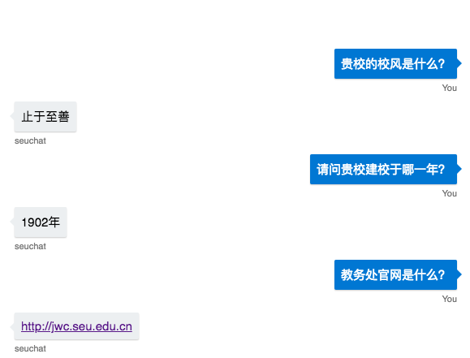

# University Chatbot

This project is for Microsoft Beauty of Programming 2017 Competition. Our Team won 32/1000 in this compeition.

This project utilized [Azure Bot Service](https://azure.microsoft.com/en-us/services/bot-service) and [LUIS](https://azure.microsoft.com/en-us/services/cognitive-services/language-understanding-intelligent-service/). The purpose of our chat bot is to provide a Chinese Chat Bot to help students know more about our University. It could answer some questions like these:

- 吴建平是你们学校计算机科学与技术系的系主任吗？(Is Wu Jianping the head of the Department of Computer Science and Technology at your school?)
- 请问贵校建校于哪一年？(What year was your school built?)
- 贵校有多少本科专业？(How many undergraduate majors does your school have?)
- 贵校的校风是什么？(What is the school spirit of your school?)
- 你们的校歌是什么？(What is your school song?)
- 教务处官网是啥？(What is the official website of the Academic Affairs Office?)
- 党委办公室联系电话是多少？(What is the telephone number of the party committee office?)
- 你们学校坐落于哪座城市/省份？(Which city/province is your school located in?)
- 你们学校有多少工程院院士？(How many academicians in the school are there in your school?)
- 贵校有多少学院？(How many colleges are there in your school?)
- 请问计算机科学与技术系上一任系主任是谁？(Who is the former head of the Department of Computer Science and Technology?)
- 请问计算机系系主任是谁？(Who is the head of the computer department?)
- 你们的校歌的词曲作者分别是谁？(Who are the songwriters of your school songs?)
- 你们大学本科生占学生总数为多少？(What is the total number of students in your undergraduate university?)
- 你们学校面积最大的校区是哪个?(Which school district is the largest in your school?)
- 请问贵校是建校于建国前么？(Is your school before the founding of the People's Republic of China?)
- 请问你们学校是在华东地区么？(Is your school in East China?)

The system graph is below. After getting requests from user, our system will use LUIS to understand each question based on Pre-defined Sentence Structure and Intent. Then it will extract Entity and Intent, sending them to Azure Bot Service, which written in **C#**. Then it will find this relationship in the Database, which is saved as tuple (Entity, Relation, Entity). Next, Bot will get the result and send back to user.

So running our program requires a Azure Bot Service and Azure SQL server. 

## Web Craweler

In the beginning, we used [Scrapy](https://scrapy.org/) to get documents in our University Official Sites, which contains information. And we also get some information from [shuyan](http://shuyantech.com/) that contains more structured data for us. 

Then we wrote some Python Script to help us to extract information. These codes you could see in the `python` folder.

We defined these intent:

- people
- scores
- whether or not
- address
- number
- major
- time
- logo
- website
- telephone

For each intent, we put predefined tuple in SQL database.

## Bot Service

The bot code could find in `messages/BasicLuisDialog.csx`. The main idea is it could return answer based on LUIS model intent. For different intent, it will first check similar name and then query in SQL server.

Demo

